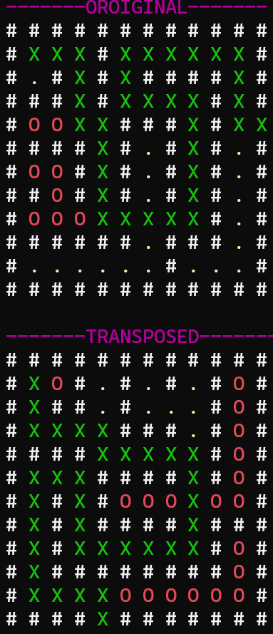

## Description
This program employs recursive techniques to solve a maze stored as an array. It assumes the maze contains an exit but cannot determine if an exit is absent. The maze consists of '#' representing walls and '.' representing paths.

Moves can be made only up, down, left, or right (not diagonally), one spot at a time, and only over paths (not through walls). The exit is any spot on the outer edges of the array.

The program endeavors to find a path to the exit, marking each spot along the path with 'X'. If it reaches a dead end, the 'X's are replaced with '0'. However, spots marked '0' are reverted to 'X' if they are part of a successful path leading to the exit.

## Images

